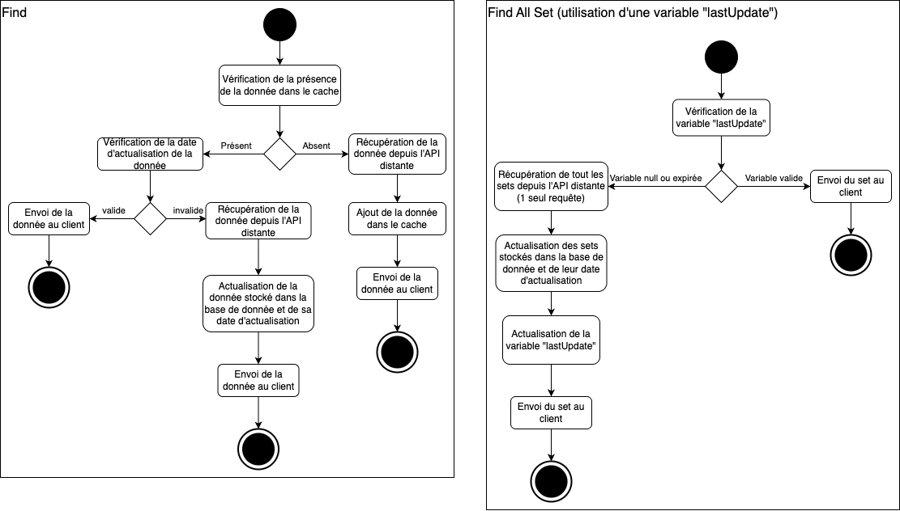

# R401 - Architecture logicielle

> Documentation de l'API disponible à l'adresse (intranet de l'Université de Nantes) : [http://172.21.45.43:8080/doc/](http://172.21.45.43:8080/doc/) ou dans le fichier `API-Documentation.md`

## Présentation

Nous avons développé plusieurs micro-services sous la forme d'API REST pour la consultation et la gestion de cartes Pokémon.

## Problématique

Comment créer une plateforme permettant aux utilisateurs de gérer, optimiser et valoriser leur collection de cartes Pokémon, tout en offrant des fonctionnalités pour identifier les cartes les plus rares et recherchées, et en facilitant l'interaction avec d'autres collectionneurs ?

* **pokapi-data** : Ce microservice se concentre sur la consultation des informations sur les cartes Pokémon et les Sets. Cela répond au besoin des utilisateurs de connaître la valeur et la rareté de leurs cartes.

* **pokapi-user** : Ce microservice gère les utilisateurs et leurs collections. Il permet aux utilisateurs de s'inscrire, de se connecter, de voir leurs cartes et d'ouvrir des boosters, ce qui répond au besoin de gestion personnelle de la collection et d'interaction avec la plateforme.

## Architecture des micro-services

## Services développés

Les trois micro-services principaux développés sont les suivants :

+ Pokapi-data : consultation des informations sur les cartes Pokémon et les *Sets* en reposant sur l'API publique [https://pokemontcg.io/](https://pokemontcg.io/)
+ Pokapi-user : gestion des comptes des utilisateurs et de leur collection
+ Pokapi-proxy : proxy qui fait office de point d'entré unique aux différents services

D'autres services ont été développés pour les besoins de la ressource R410 :

+ Pokapi-openai : permet de disscuter avec les Pokémon repose sur [GPT-4.1](https://openai.com/index/gpt-4-1/)
+ Pokapi-stub : permet de fournir des réponses prédéfinies pour le développement et les tests

## Bibliothèques utilisées 

- [Express.js](https://expressjs.com/fr/)
- [JWT](https://jwt.io/)
- [Mongoose](https://mongoosejs.com/)
- [MongoDB](https://www.mongodb.com/)

## Test

Les trois micro-services principaux possèdent de nombreux tests qu'il est possible de lancer avec `npm test`. Pour que les tests fonctionnent, certaines configurations sont nécessaire :

- **Pokapi-data :** les tests fonctionnent sans configuration particulière mais il est préférable de passer la variable `ENV` en `TEST`.
- **Pokapi-user :** il est préférable de passer la variable `ENV` en `TEST` et il faut obligatoirement lancer Pokapi-stub avec `npm start` et renseigner sont adresse dans le `.env`.
- **Pokapi-proxy :** il faut avoir Pokapi-data et Pokapi-user de lancer avec `npm start` et s'assurer que les adresses dans le `.env` sont correctes. Cependant Pokapi-user ne doit cette fois ci pas être lancé avec Pokapi-stub mais bien avec Pokapi-data.

Si des problèmes surviennent il est possible de configurer certaines options dans les fichiers `.env` de chaque service pour cela voir le fichier `.env.example`.

## Déploiement 

Les services ont été déployés à l'adresse [http://172.21.45.43:8080/doc/](http://172.21.45.43:8080/doc/). Nous avons mis en place la base de données MongoDB. Ensuite nous avons utilisé [PM2](https://www.npmjs.com/package/pm2), le script utilisé pour le déploiement est disponible à la racine du repository : `deploy.sh`.

## Fonctionnement cache 

Dans le service Pokapi-data pour limiter le nombre de requêtes envoyées à l'API externe nous avons mis en place en système de cache. Voici un schéma des deux systèmes de mise en cache utilisés :

### Données mise en cache :

- sets
- cards
- rarities
- types

