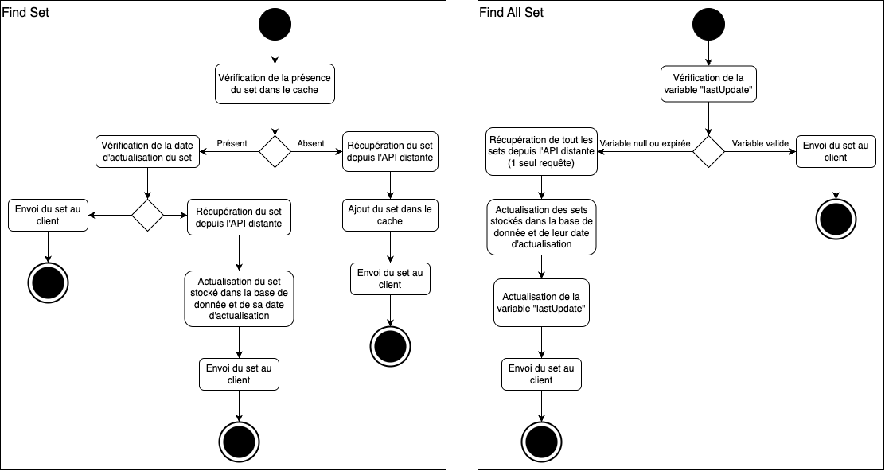

# R401 - Architecture logicielle

### Liste des routes dans `API.md` 

## Problématique

Comment créer une plateforme permettant aux utilisateurs de gérer, optimiser et valoriser leur collection de cartes Pokémon, tout en offrant des fonctionnalités avancées pour identifier les cartes les plus puissantes, rares et recherchées, et en facilitant l'interaction avec d'autres collectionneurs ?

* **pokapi-data** : Ce microservice se concentre sur l'analyse des cartes Pokémon pour déterminer celles qui sont les plus puissantes, rares et recherchées. Cela répond au besoin des utilisateurs de connaître la valeur et la rareté de leurs cartes.

* **pokapi-user** : Ce microservice gère les utilisateurs et leurs collections. Il permet aux utilisateurs de s'inscrire, de se connecter, de voir leurs cartes et d'ouvrir des boosters, ce qui répond au besoin de gestion personnelle de la collection et d'interaction avec la plateforme.

*Schéma global Thomas*

## Test

*Thomas*

## Déploiement 

*Thomas*

## Fonctionnement cache 

### Données mise en cache :
- sets
- cards
- rarities
- types
### Diagramme :
