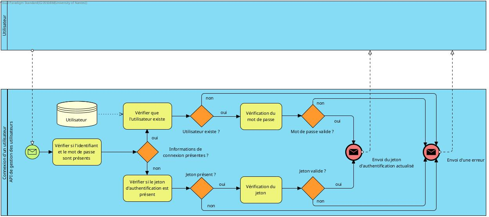
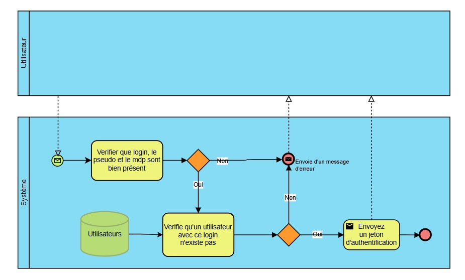
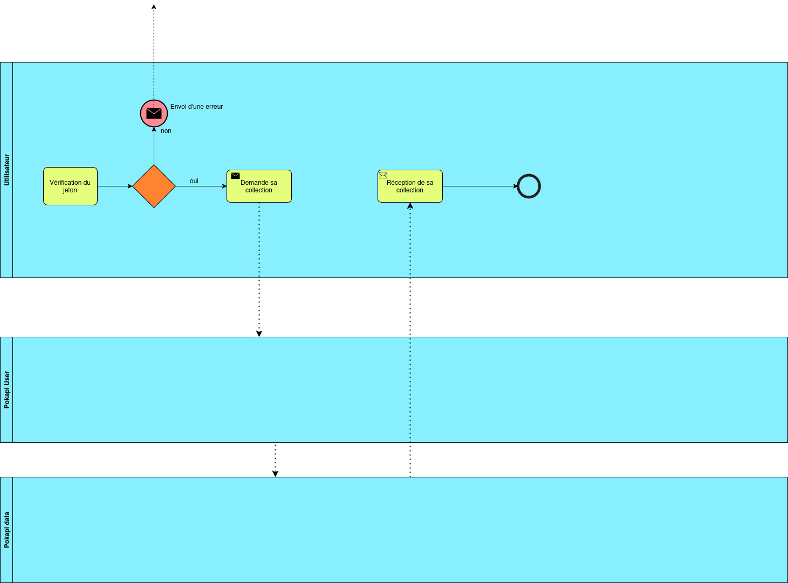
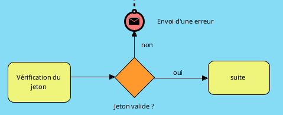

# Diagrammes BPMN

Le but de ces diagrammes n'est pas de représenter les détails techniques mais le fonctionnement global et les interractions entre les différents acteurs qui sont : 

* l'utilisateur, 
* l'API de gestion des utilisateurs (pokapi-user), 
* l'API de gestion des cartes (pokapi-data),
* l'API Pokémon externe.

Il faut modéliser des cas d'usage **complets**, c'est à dire des enchaînements d’actions côté utilisateur + logique serveur et pas juste le fonctionnement d'une route.

Pour chaque cas suivant une courte description a été faite mais tout n'est pas écris il faut bien penser a tous les appels entre les APIs qui sont faits.

## 1 - Connexion : *Thomas*

L'utilisateur dispose d'un jeton ou de son login et mdp. Soit le système vérifie la validité du jeton. Soit le système vérifie si un utilisateur avec ce login existe puis il vérifie que les mdp correspondent. Dans les 2 cas si l'authentification est réussie le système renvoie un jeton sinon une erreur.

## 2 - Création de compte : *Brieuc*

L'utilisateur envoie au système le login, le pseudo et le mdp. Le système vérifie qu'un utilisateur avec ce login n'existe pas, si c'est bon alors le système renvoie un jeton d'authentification sinon une erreur.

## 3 - Ouverture d'un booster : *Pol*

Ce cas d'usage nécessite une connexion. Vous pouvez mettre au début du diagramme le morceau ci-dessous.

Voici le fonctionnement global, il faut aller plus en détail dans les appels aux 3 API :

L'utilisateur commence par récupérer tous les sets depuis pokapi-data puis il choisi un set après il demande d'ouvrir un booster avec le set choisi, l'API récupère toutes les cartes du set, elle en choisi 5 au hasard. Enfin elle ajoute les 5 cartes à la collection de l'utilisateur et renvoie les 5 cartes à l'utilisateur.

**Commentaire apportés par Thomas :**

Le diagramme est clair, mais certains éléments, notamment autour du cache, sont trop détaillés. Il vaudrait mieux simplifier en représentant uniquement la vérification du cache, une gateway “cache valide ?”, puis l’appel à l’API ou l’envoi des données, sans inclure des tâches comme l’actualisation de variables ou du cache.

L’objectif est de montrer le comportement fonctionnel, pas les détails techniques.
Quelques corrections à prévoir également :
- Il manque un événement de fin pour l’utilisateur et pokapi-user.
- Une pool ne peut pas contenir plusieurs événements de début, comme c’est le cas dans pokapi-data ; tu pourrais chaîner les deux processus avec un événement intermédiaire.

## 4 - Voir la collection de cartes : *Kyllian*

Ce cas d'usage nécessite une connexion. Vous pouvez mettre au début du diagramme le morceau ci-dessous.

L'utilisareur demande sa collection, pokapi user récupère la collection puis demande à pokapi-data les infos de toutes les cartes de la collection. Enfin pokapi-user renvoie toutes les cartes de la collection.

## 5 - Mettre à jour les informations de connexion : *?*

Ce cas d'usage nécessite une connexion. Vous pouvez mettre au début du diagramme le morceau ci-dessous.

L'utilisateur demande de changer son pseudo ou son mot de passe ou les deux. L'API met à jour les infos de l'utilisateur et renvoie les nouvelles infos de l'utilisateur.

## Partie du diagramme pour vérifier la connexion

