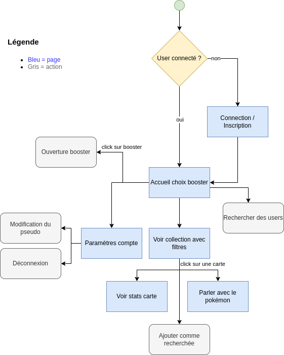

# Pokapi

> [Lien de la maquette Figma](https://www.figma.com/design/psU19cATXeNnEl7xmLXVrJ/Pokemon?node-id=0-1&t=ld5RRQsjuS7JdJmA-1)

## Instruction

Pour lancer le site il faut faire `npm run dev`, le site apparait à cette URL : [http://localhost:5173/](http://localhost:5173/).

Pour que les requêtes à l'API fonctionnent durant le développement du site, on utilise le stub présent dans `R401.../pokapi-stub`, il faut le lancer avec `npm start` (installer les dépendances si nécessaire avec `npm install`).

Les identifiants pour se connecter avec le stub sont : `login: admin ; password: admin`.

## Organisation des dossiers

+ src
    + assets : pour mettre vos images
    + components : Un fichier par composant que vous pouvez après intégrer dans vos pages. Vous pouvez mettre le style CSS directement dans le JSX avec des objets, prenez exemple sur le `Header.jsx`.
    + pages : Chaque page a son fichier pour mettre tous vos composants (définits dans `components`) ensembles. Ces composants de pages (`Home.jsx`, `Collection.jsx`, ...) sont ensuite automatiquement intégrer dans le fichier `App.jsx` avec le composant `<Outlet/>`.

## Docs et ressources à utiliser

- [Radix UI](https://www.radix-ui.com/themes/docs/components/alert-dialog) : C'est la librairie de composant React dèjà fait que l'on utilise, lisez bien la doc il y a plein de choses que vous pouvez utiliser (boutons, modales, conteneur flex, etc). Cela nous permet de gagner du temps sur les composants simples par contre leur style n'est pas facilement modifiable.
- [Lucide Icons](https://lucide.dev/icons/) : Si vous voulez ajouter des icônes, vous avez juste à cliquer sur une icône et faire *Copy JSX*. 
- [Slick](https://react-slick.neostack.com/) : Librairie pour le carousel de la page d'accueil (à confirmer)
- [React router](https://reactrouter.com/start/declarative/navigating)
- [React](https://react.dev/reference/react)

## Tâches à faire

> 🟢 = Commencé

- [x] Formulaire login / register
    - [x] Style de la page (cf. maquette)
    - [x] Gestion des tokens avec **localstorage**
- [x] Header
    - [x] Ajouté la navigation fonctionnelle avec le react router
    - [x] Responsive
- [ ] Footer 🟢
  - [x] Responsive
- [x] Collection
    - [x] Fetch pour récupérer la collection
    - [x] Style de la page (cf. maquette)
    - [x] Filtres
    - [x] Recherche
    - [x] Boutton clear filtres
- [x] Home
    - [x] Carousel avec les booster 
        - [x] Choisir lib pour faire le carousel => [Slick](https://react-slick.neostack.com/) ?
        - [x] Gérer le chargement au fur et à mesure
        - [x] Responsive
- [x] Card
    - [x] Style de la page (cf. maquette)
    - [x] Chat avec Pokemon
- [ ] Account 🟢
    - [ ] Style de la page (cf. maquette)
- [x] Page opening booster
- [ ] Bouton page /sets à mettre à un endroit

---
- [ ] Recherche utilisateurs

## Plan de l'application

