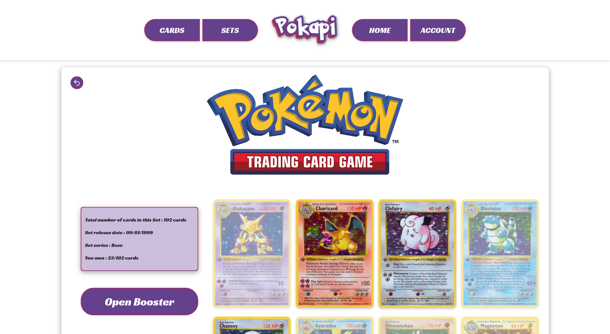
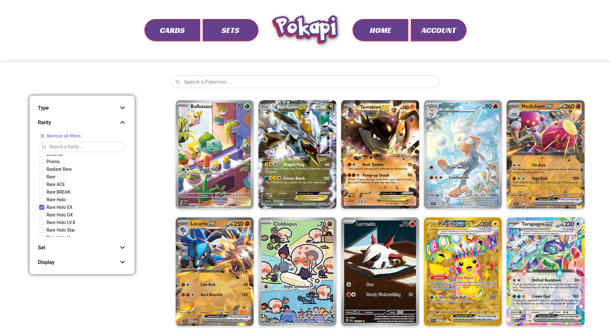
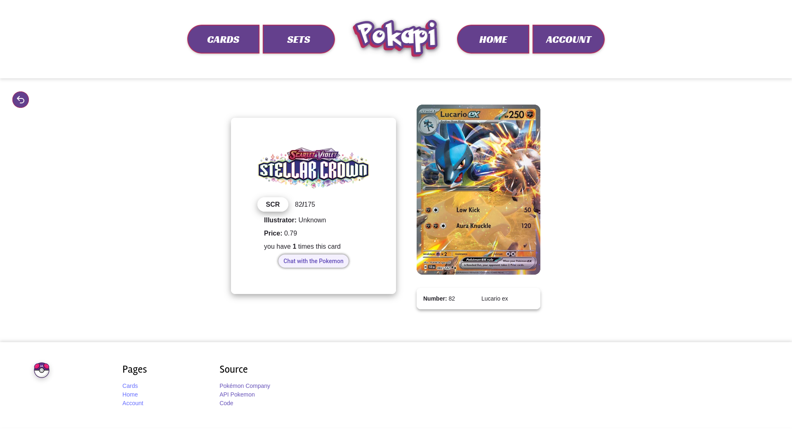
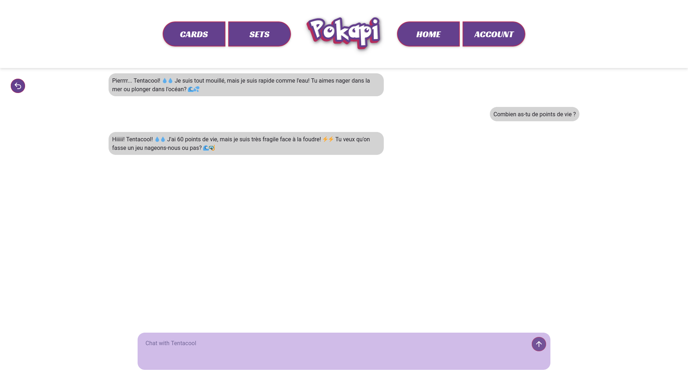
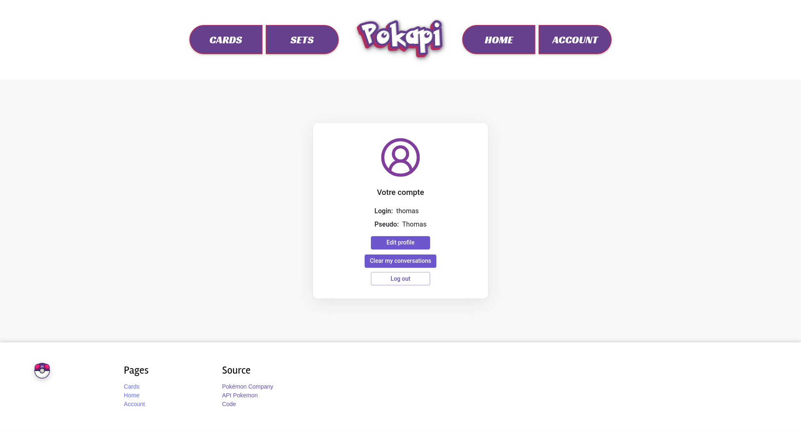

# R410 - Complément web

> Lien de l'application déployée (intranet de l'Université de Nantes) : [http://172.21.45.43](http://172.21.45.43)

## Présentation

Nous avons créé une application web "one page" avec React reposant sur l'utilisation des micro-services développés dans la ressource R401. Notre application permet de collectionner des cartes Pokémon en ouvrant des paquets de cartes aléatoires appelés *booster*.

## Fonctionnalités

#### Page / :
- Choix d'une extentions avec un carrousel (chargement progressif)
- Ouvrir un booster (5 cartes) d'une extension au choix

#### Page /sets :
- Visualiser toutes les extensions existantes
- Recherche dynamique en fonction du nom
- Affichage progressif des extensions

#### Page /set :
- Visualiser toutes les cartes d'une extension
- Ajouter des cartes comme "recherchée"

#### Page /collections :
- Visionner toute ses cartes
- Filter les cartes affichées en fonctions des critères :
    - Type
    - Rareté
    - Extension
- Séparer les cartes en fonction de leurs extensions (choix enregistré dans le `localStorage`)
- Visionner les cartes recherchées
- Recherche dynamique en fonction du nom

#### Page /card :
- Voir la carte avec un effet visuel
- Voir la carte en grand format
- Voir les informations suivantes : 
    - l'extension de la carte
    - le numéro de la carte
    - l'illustateur de la carte
    - le prix de la carte
    - le nombre d'examplaires possédés
- Accéder à la page de discussion avec le Pokemon

#### Page /chatpokemon :
- Discuter avec le Pokemon (ChatGPT) (sauvegarde de la discussion dans le `localStorage`)

#### Page /account :
- Modifier ses informations personnelles
- Effacer les conversations avec les pokemons (`localStorage`)
- Se déconnecter

#### Page /auth/login et /auth/register :
- Se connecter
- Créer un compte

## Déploiement

Le déploiement a été effectué sur une VM à cette adresse [http://172.21.45.43](http://172.21.45.43) avec un serveur Apache.

Pour déployer cette application, il faut installer Apache puis activer le module `rewrite`. Ensuite il faut modifier la configuration du site par défaut pour ajouter : `RewriteEngine On` et `FallbackResource /index.html`. Ensuite dans le dossier de l'application exécuter : `npm run build` puis copier le contenu du dossier `/dist` dans `/var/www/html`.

## Bibliothèques utilisées

- [Vite.js](https://vite.dev/)
- [React](https://react.dev/reference/react)
- [Radix UI](https://www.radix-ui.com/themes/docs/components/alert-dialog)
- [React router](https://reactrouter.com/start/declarative/navigating)
- [Lucide Icons](https://lucide.dev/icons/)
- [Swipper](https://swiperjs.com/)

## Captures d'écran

#### Home

#### Set

#### Collection

#### Card

#### Chat

#### Account

