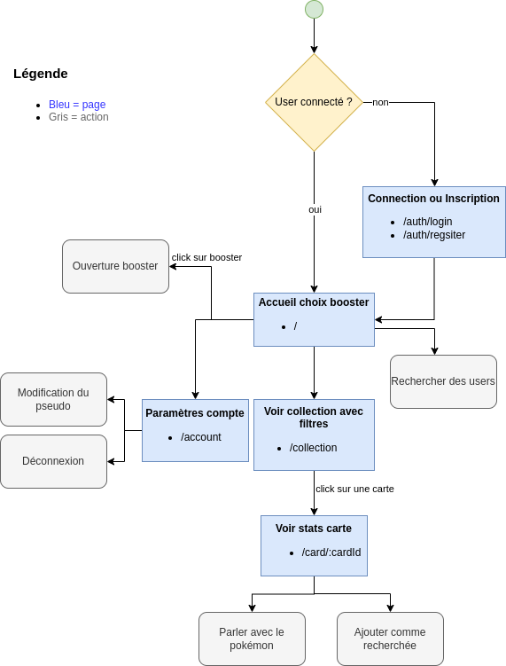

# Pokapi

Application React.

## TODO

- [ ] Config React router
- [ ] Ajouter UI lib

## Plan de l'application

## UI Lib

**A choisir :**

1. ~~**Styled-components**~~ - Permet de créer des composants React avec des styles CSS personnalisés, y compris les polices.

2. **Chakra UI** - Offre un système de thème très flexible pour personnaliser tous les aspects visuels, dont les polices.

3. ~~**Material-UI (MUI)**~~ - Comprend un système de thème complet qui permet de modifier les polices et autres styles.

4. ~~**Tailwind CSS**~~ - Bien que ce soit un framework utilitaire, il permet une personnalisation complète des thèmes, y compris les polices.

5. **Theme UI** - Spécialement conçu pour des thèmes personnalisés avec des tokens pour les polices, couleurs, etc.

6. **Ant Design** - Propose une personnalisation du thème via des variables moins.

7. **Radix UI** - Offre des primitifs non stylisés que vous pouvez styliser entièrement selon vos besoins.

## React + Vite

This template provides a minimal setup to get React working in Vite with HMR and some ESLint rules.

Currently, two official plugins are available:

- [@vitejs/plugin-react](https://github.com/vitejs/vite-plugin-react/blob/main/packages/plugin-react/README.md) uses [Babel](https://babeljs.io/) for Fast Refresh
- [@vitejs/plugin-react-swc](https://github.com/vitejs/vite-plugin-react-swc) uses [SWC](https://swc.rs/) for Fast Refresh
