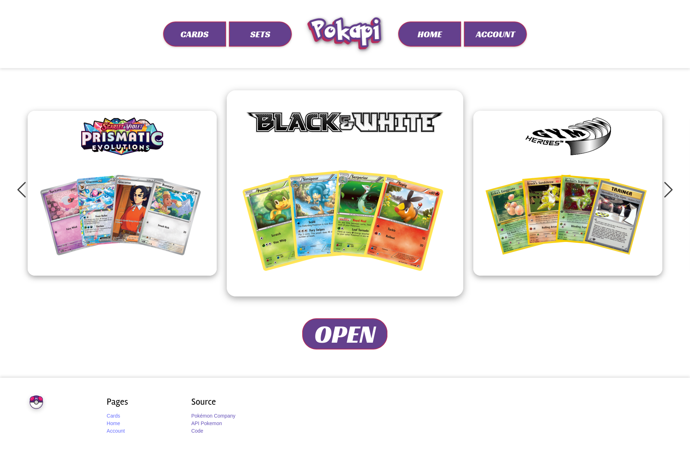

# SAE4_class_grp1_eq1_ARNAUD-Kyllian_DESTAIN-Jauzua_LAMOTHE-Pol_LE--CARLUER-Brieuc_SOUCHET-Thomas

**Groupe_1_1 :** Thomas Souchet, Kyllian Arnaud, Pol Lamothe, Brieuc Le Carluer, Jauzua Destain

Ce repository regroupe les différentes ressources de la SAE401 Développement d'une application complexe.

Listes des ressources présentes : 

+ [R401 - Architecture logicielle](https://gitlab.univ-nantes.fr/pub/but/but2/sae4/sae4_class_grp1_eq1_arnaud-kyllian_destain-jauzua_lamothe-pol_le-carluer-brieuc_souchet-thomas/-/tree/main/R401-Architecture_logicielle?ref_type=heads)
+ [R410 - Complément web](https://gitlab.univ-nantes.fr/pub/but/but2/sae4/sae4_class_grp1_eq1_arnaud-kyllian_destain-jauzua_lamothe-pol_le-carluer-brieuc_souchet-thomas/-/tree/main/R410-Complement_web/pokapi?ref_type=heads)
+ [R408 - Virtualisation](https://gitlab.univ-nantes.fr/pub/but/but2/sae4/sae4_class_grp1_eq1_arnaud-kyllian_destain-jauzua_lamothe-pol_le-carluer-brieuc_souchet-thomas/-/tree/main/R408-Virtualisation?ref_type=heads)
+ [R409 - Management avancé des systèmes d'information](https://gitlab.univ-nantes.fr/pub/but/but2/sae4/sae4_class_grp1_eq1_arnaud-kyllian_destain-jauzua_lamothe-pol_le-carluer-brieuc_souchet-thomas/-/tree/main/R409-MASI?ref_type=heads)
+ [R412 - Automates et langages](https://gitlab.univ-nantes.fr/pub/but/but2/sae4/sae4_class_grp1_eq1_arnaud-kyllian_destain-jauzua_lamothe-pol_le-carluer-brieuc_souchet-thomas/-/tree/main/R412-Automates_langages?ref_type=heads)

Liens des applications déployées (intranet de l'Université de Nantes) :

+ R401, micro-services : [http://172.21.45.43:8080/doc/](http://172.21.45.43:8080/doc/)
+ R410, Pokapi : [http://172.21.45.43/](http://172.21.45.43/)

## R401 - Architecture logicielle

Voir dossier `R401-Architecture_logicielle`.

Création de plusieurs micro-services communicants en JavaScript sous forme d'API REST avec la bibliothèque Express.js. 

## R410 - Complément web

Voir dossier `R410-Complement_web/pokapi`.

Création d'une application web "one page" avec React reposant sur l'utilisation des micro-services développés dans la ressource R401.

## R408 - Virtualisation

Voir dossier `R408-Virtualisation`.

Conteneurisation d'un framework PHP avec Podman. 

## R409 - Management avancé des systèmes d'information

Voir dossier `R409-MASI`.

Modélisation à l'aide de diagramme BPMN de processus métier de l'application développée dans la ressource R401. 

## R412 - Automates et langages

Voir dossier `R412-Automates_langages`.

Modélisation du fonctionnement du micro-service de consultation des données des cartes Pokémon (pokapi-data) à l'aide d'automates à états.

## Annexes

### Architecture R401 et R410

Voici un schéma de l'architecture globale des micro-services développés ainsi que de l'application web.

## Application Pokapi

Voici une capture d'écran de l'application web Pokapi.

