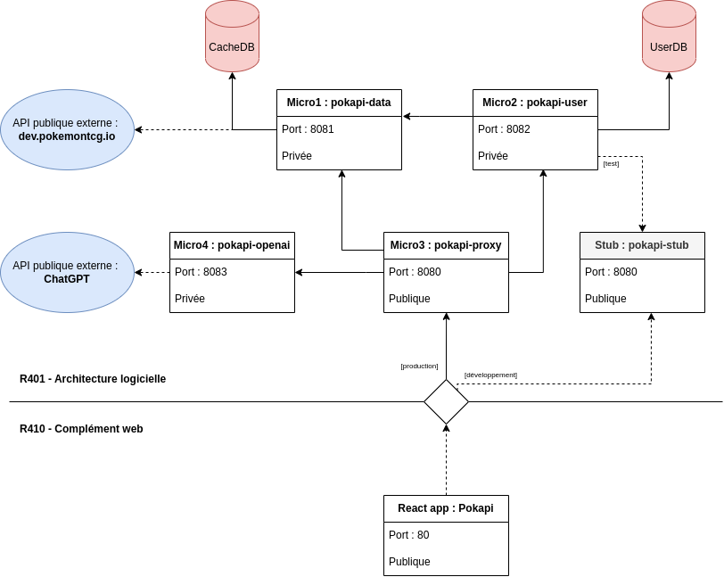

# SAE4_class_grp1_eq1_ARNAUD-Kyllian_DESTAIN-Jauzua_LAMOTHE-Pol_LE--CARLUER-Brieuc_SOUCHET-Thomas

Ce repository a pour but de rassembler les différentes parties de la SAE (au moins R401 et R410 à voir pour les autres).

## Architecture R401 et R410

## R401 - Architecture logicielle

**Consignes :**

Vous devrez créer plusieurs micro-services communicants, facilement déployables sur les VM de l’IUT. Chaque micro-service devra être documenté et fourni avec des jeux de tests. Pour la partie serveur HTTP, vous pouvez utiliser le middleware ou le framework de votre choix. Le rendu final sera sur la forme d’une revue de code et une présentation du projet. Vous devrez un jour avant la soutenance avoir déposer sur git votre code, un fichier markdown décrivant l’application et son déploiement et la mise en oeuvre des tests.

A minima devront être créés 3 micro-services répondant à une problématique énoncée :

 * Un proxy point d'entré du système
 * Un service reposant sur un jeu de données externes de votre choix
 * Un service libre

Vous devrez pour chaque service fournir les tests du modèle, des contrôleurs, de l'application ainsi que la documentation.

## R410 - Complément web

**Consignes :**

Vous devrez développer une application de préférence « one page » sur des services rest de votre choix, la richesse des fonctionnalités, l’ergonomie, l’utilisation de la mémoire et du CPU seront pris en compte. Le rendu final sera sous la forme d’une revue de code et d'une présentation du projet. Vous devrez un jour avant la soutenance avoir déposé sur git votre code, un fichier markdown décrivant l’application et son déploiement, (le déploiement sur un serveur apache doit-être possible).
